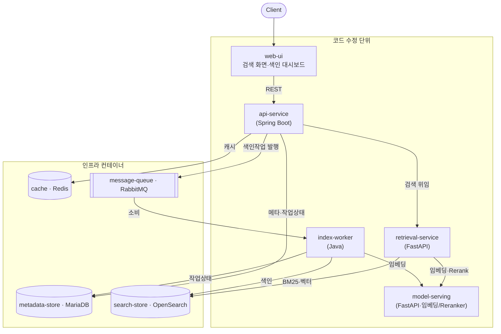

# 시스템 설계 (프레임워크)

구현에 필요한 골격(컨테이너 책임·인터페이스 계약·데이터 모델·흐름·규약)을 정의한다.
실제 코드와 테스트는 사용자가 작성하며, 이 문서는 그 경계를 제시한다. 결정 근거는
[ADR](adr/README.md), 요구사항은 [요구사항](../derived/side-project-requirements.md),
측정은 [평가 계약](evaluation-contract.md)을 따른다.

## 배포 단위와 책임

| 단위 | 책임 | 인바운드 | 의존(아웃바운드) |
|---|---|---|---|
| web-ui (프론트엔드) | 검색 화면·색인 상태 대시보드 | REST(브라우저) | api-service |
| api-service (Spring) | 검색·색인 요청 진입점, 작업 상태, 캐시 정책 | REST | cache·metadata-store·retrieval-service·message-queue |
| retrieval-service (FastAPI) | Dense·Hybrid 결합, 검색 오케스트레이션 | REST | search-store·model-serving |
| model-serving (FastAPI) | 임베딩·Reranker 모델 추론 | REST | (GPU/모델 런타임) |
| index-worker (Java) | 수집→파싱→청킹→임베딩(호출)→색인, 재시도·중복방지 | 큐 소비 | message-queue·model-serving·search-store·metadata-store |
| search-store (OpenSearch) | BM25·벡터·Hybrid 색인/검색 | REST(9200) | — |
| metadata-store (MariaDB) | 문서·청크·작업 메타데이터 | TCP(3306) | — |
| cache (Redis) | 검색 응답 캐시·무효화 | TCP(6379) | — |
| message-queue (RabbitMQ) | 색인 작업 큐·재시도·DLQ | AMQP(5672) | — |

## 아키텍처 구조도



검색 경로 가용성은 메시지 큐가 아니라 복제·캐시·rate limit·서킷브레이커로 확보하며,
메시지 큐는 색인 경로에 한정한다([ADR-0008](adr/0008-search-availability.md)).

## 인터페이스 계약 (초안)

구체 스키마는 구현 시 OpenAPI/스키마로 확정한다. 아래는 골격이다.

- api-service
  - `POST /search` `{query, k, mode: bm25|dense|hybrid}` → `{results:[{docId, score, snippet}], tookMs}`
  - `POST /index` `{source...}` → `{jobId}` (message-queue로 발행)
  - `GET /jobs/{id}` → `{status, attempts, error?}`
- retrieval-service
  - `POST /retrieve` `{query, k, mode}` → `{results}` (search-store 질의 + 필요 시 model-serving 임베딩/Reranker)
- model-serving
  - `POST /embed` `{texts[]}` → `{vectors[][]}`
  - `POST /rerank` `{query, passages[]}` → `{scores[]}`
- index-worker: HTTP 인바운드 없음. message-queue의 색인 작업을 소비.

## 데이터 모델 (개요)

- `documents(id, source, title, created_at, ...)`
- `chunks(id, document_id, ord, text, embedding_ref?, ...)`
- `index_jobs(id, type, status, attempts, created_at, updated_at, error)`
- 작업 상태 기계: `pending → running → done | failed`; `failed → (재시도) → running`, 한계 초과 시 `dead`.

## 흐름

```text
검색:  client → api-service →(cache 조회)→ retrieval-service
          → search-store(BM25/벡터) (+ model-serving 임베딩·Rerank) → 결과 → cache 저장 → client
색인:  client → api-service →(message-queue 발행)→ index-worker
          → 수집·파싱·청킹 → model-serving 임베딩 → search-store 색인 + metadata-store 기록
          → 상태 갱신(작업 테이블), 실패 시 재시도/DLQ
```

## 공통 규약

- 설정은 환경변수로 주입(.env.example 키 기준), 비밀값은 추적하지 않는다.
- 컨테이너 런타임 규칙(비루트·호스트 UID/GID·TZ=UTC·UTF-8)은
  [런타임·배포](runtime-and-deployment.md)와 `runtime-rules-check.sh`를 따른다.
- 각 서비스는 헬스 체크 엔드포인트와 구조화 로그를 제공한다.
- 캐시 키는 `query+mode+k` 기준, 색인 변경 시 무효화한다.

## 구현 골격 지침 (언어별)

에이전트는 아래 골격(빈 구조·인터페이스)까지만 제공하고, 구현·테스트는 사용자가 한다.

- api-service (Spring Boot): `controller → service → repository(JPA/QueryDSL)` +
  `client`(OpenSearch·retrieval-service·RabbitMQ), 프로파일별 설정.
- retrieval-service·model-serving (FastAPI): `router → service → client`, pydantic 모델,
  uvicorn 기동.
- index-worker (Java): `consumer → pipeline 단계(parse/chunk/embed/index) → client`,
  멱등 처리·재시도.

세부 클래스·함수·테스트는 [WBS](wbs.md) 항목 단위로 사용자가 구현하고 에이전트가 리뷰한다.
